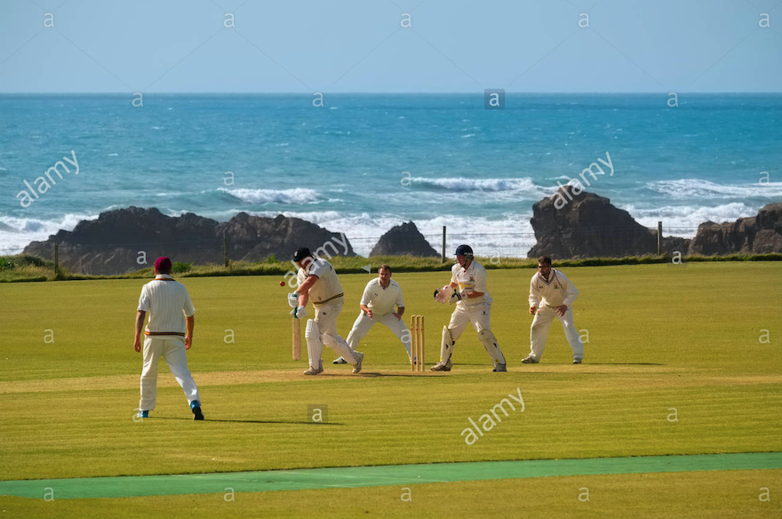

```{r setup, include=FALSE}
knitr::opts_chunk$set(echo = TRUE)
```

## Introduction 

Find the town of Bude in Western England. This is a town that is well-known as a beach resort. You're going to make two maps of Bude – a road map and a watercolor map.

On both maps, mark the map with vacation spots you might like: surfing beaches and the cricket grounds (one of the most stunning the the country and very local). Pick two local beaches (this will require some googling).

Finally find a pub that is convenient to the cricket grounds. Mark the route from the grounds to the pub.

## Bude, England
```{r, message=TRUE, include=FALSE}
library(ggmap)
library(tidyverse)
gc1 <- geocode("Bude, England")
gc2 <- geocode("Summerleaze Beach, Bude")
gc3 <- geocode("Crooklets Beach, Bude")
gc4 <- geocode("Bude North Cornwall Cricket Club, Bude")
gc5 <- geocode("Bar 35, Bude")
map1 <- get_map(gc1)
map2 <- get_map(gc2, zoom = 15)
map3 <- get_map(gc3, zoom = 15)
map4 <- get_map(gc4, zoom = 15)
map5 <- get_map(gc5, zoom = 15)
map6 <- get_map(gc1, zoom = 15)
```

```{r, echo=FALSE, message=FALSE}
ggmap(map1) + geom_point(aes(x = lon, y = lat), data = gc1, color = "red", size = 3)
```


## Road Map of Bude
```{r, echo=FALSE, message=FALSE}
road_bude <- get_map(gc1, zoom= 14, maptype = "roadmap")
Road1 <- ggmap(road_bude) + geom_point(aes(x = lon, y = lat), data = gc1, color = "red", size = 3) +
  geom_text(aes(x = lon, y = lat, label="Bude"), data = gc1, color = "black", vjust = 1.5, size = 3)
Road1
```

## Watercolor Map of Bude
```{r, echo=FALSE, message=FALSE}
water_bude <- get_map(gc1, zoom= 14, maptype = "watercolor")
Water1 <- ggmap(water_bude) + geom_point(aes(x = lon, y = lat), data = gc1, color = "red", size = 3)+
  geom_text(aes(x = lon, y = lat, label="Bude"), data = gc1, color = "black",vjust=1.5, size = 3)
Water1
```


## Beach 1, Summerleaze Beach
```{r, echo=FALSE, message=FALSE}
ggmap(map2) + geom_point(aes(x = lon, y = lat), data = gc2, color = "orange", size = 3)
```


```{r, echo=FALSE, message=FALSE}
Road2 <- Road1 + geom_point(aes(x = lon, y = lat), data = gc2, color = "orange", size = 3)
Road2
```

```{r, echo=FALSE, message=FALSE}
Water2 <- Water1 +  geom_point(aes(x = lon, y = lat), data = gc2, color = "orange", size = 3) +
      geom_text(aes(x = lon, y = lat, label="Summerleaze Beach"), data = gc2, color = "black",hjust=1.05,size = 3)
Water2
```

## Beach 2, Crooklets Beach
```{r, echo=FALSE, message=FALSE}
ggmap(map3) + geom_point(aes(x = lon, y = lat), data = gc3, color = "yellow", size = 3) 
```


```{r, echo=FALSE, message=FALSE}
Road3 <- Road2 + geom_point(aes(x = lon, y = lat), data = gc3, color = "yellow", size = 3) 
Road3
```

```{r, echo=FALSE, message=FALSE}
Water3 <- Water2 + geom_point(aes(x = lon, y = lat), data = gc3, color = "yellow", size = 3) +
  geom_text(aes(x = lon, y = lat, label="Crooklets Beach"), data = gc3, color = "black",hjust=1.05,size = 3)
Water3
```

## Cricket Ground
```{r, echo=FALSE, message=FALSE}
ggmap(map4) + geom_point(aes(x = lon, y = lat), data = gc4, color = "blue", size = 3) +
  geom_text(aes(x = lon, y = lat, label="Bude North Cornwall Cricket Club"), data = gc4, hjust=1.05,size=3)
```



```{r, echo=FALSE, message=FALSE}
Road4 <- Road3 + geom_point(aes(x = lon, y = lat), data = gc4, color = "blue", size = 3) +
  geom_text(aes(x = lon, y = lat, label="Bude North Cornwall Cricket Club"), data = gc4, hjust=1.05,size=3)
Road4
```

```{r, echo=FALSE, message=FALSE}
Water4 <- Water3 + geom_point(aes(x = lon, y = lat), data = gc4, color = "blue", size = 3) +
  geom_text(aes(x = lon, y = lat, label="Bude North Cornwall Cricket Club"), data = gc4, hjust=1.05,size=3)
Water4
```

## Bar
```{r, echo=FALSE, message=FALSE}
ggmap(map5) + geom_point(aes(x = lon, y = lat), data = gc5, color = "purple", size = 3) +
  geom_text(aes(x = lon, y = lat, label="Bar 35"), data = gc5, vjust=1.4, hjust=0.5,size=3)
```


```{r, echo=FALSE, message=FALSE}
Road5 <- Road4 + geom_point(aes(x = lon, y = lat), data = gc5, color = "purple", size = 3) +
  geom_text(aes(x = lon, y = lat, label="Bar 35"), data = gc5, vjust=1.4, hjust=0.5,size=3)
Road5
```


```{r, echo=FALSE, message=FALSE}
Water5 <- Water4 + geom_point(aes(x = lon, y = lat), data = gc5, color = "purple", size = 3) +
  geom_text(aes(x = lon, y = lat, label="Bar 35"), data = gc5, vjust=1.4, hjust=0.5,size=3)
Water5
```


## Path from Cricket Club to Bar

```{r, echo=FALSE, message=FALSE}
from <- "Bude North Cornwall Cricket Club, Bude"
to <- "Bar 35, Bude"
route_df <- route(from, to, structure = "route", mode = "walking")

map6 <- get_map(gc1, zoom = 15)
ggmap(map6) + geom_path(aes(x = lon, y = lat), colour = "skyblue", size = 1.5, data = route_df, lineend = "round") +
  geom_point(aes(x = lon, y = lat), data = gc5, color = "purple", size = 3) +
  geom_text(aes(x = lon, y = lat, label="Bar 35"), data = gc5, vjust=1.4, hjust=0.5,size=3) +
  geom_point(aes(x = lon, y = lat), data = gc4, color = "blue", size = 3) +
  geom_text(aes(x = lon, y = lat, label="Bude North Cornwall Cricket Club"), data = gc4, hjust=1.05,size=3)
```


```{r, echo=FALSE, message=FALSE}
Road6 <- Road5 + geom_path(aes(x = lon, y = lat), colour = "skyblue", size = 1.5, data = route_df, lineend = "round") +
  geom_point(aes(x = lon, y = lat), data = gc5, color = "purple", size = 3) +
  geom_text(aes(x = lon, y = lat, label="Bar 35"), data = gc5, vjust=1.4, hjust=0.5,size=3) +
  geom_point(aes(x = lon, y = lat), data = gc4, color = "blue", size = 3) +
  geom_text(aes(x = lon, y = lat, label="Bude North Cornwall Cricket Club"), data = gc4, hjust=1.05,size=3)
Road6
```

```{r, echo=FALSE, message=FALSE}
Water6 <- Water5 + geom_path(aes(x = lon, y = lat), colour = "skyblue", size = 1.5, data = route_df, lineend = "round") +
  geom_point(aes(x = lon, y = lat), data = gc5, color = "purple", size = 3) +
  geom_text(aes(x = lon, y = lat, label="Bar 35"), data = gc5, vjust=1.4, hjust=0.5,size=3) +
  geom_point(aes(x = lon, y = lat), data = gc4, color = "blue", size = 3) +
  geom_text(aes(x = lon, y = lat, label="Bude North Cornwall Cricket Club"), data = gc4, hjust=1.05,size=3)
Water6
```


